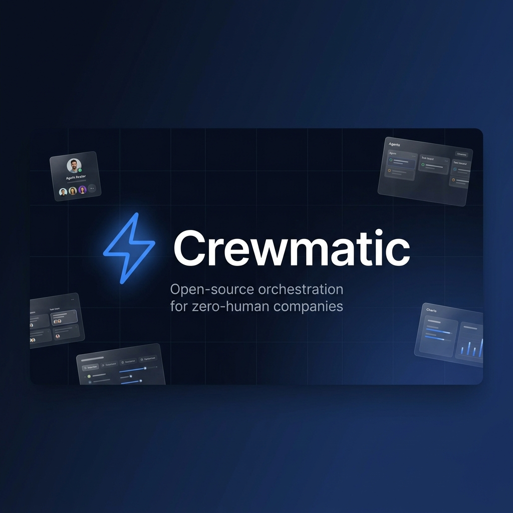
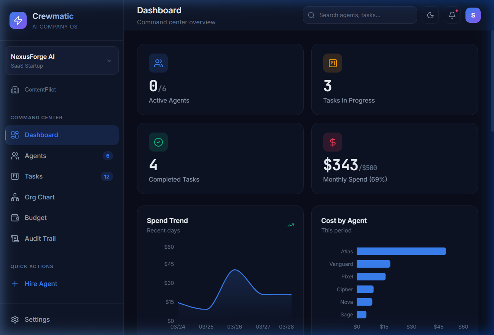
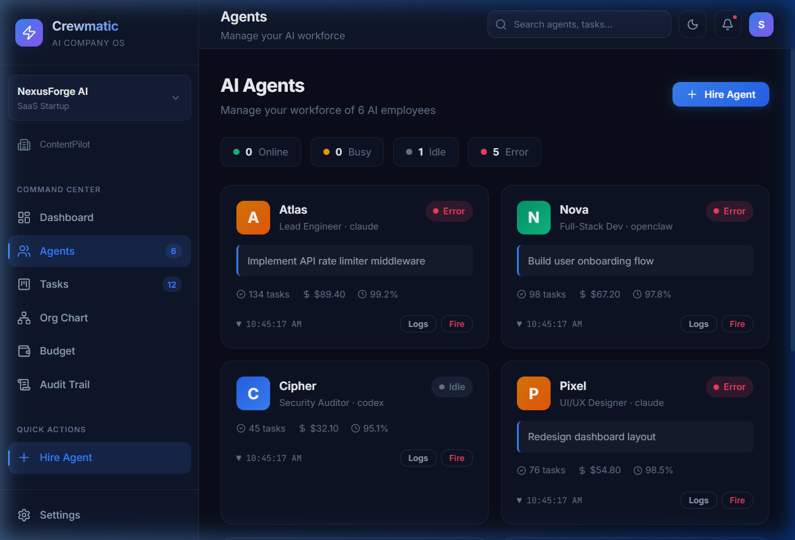
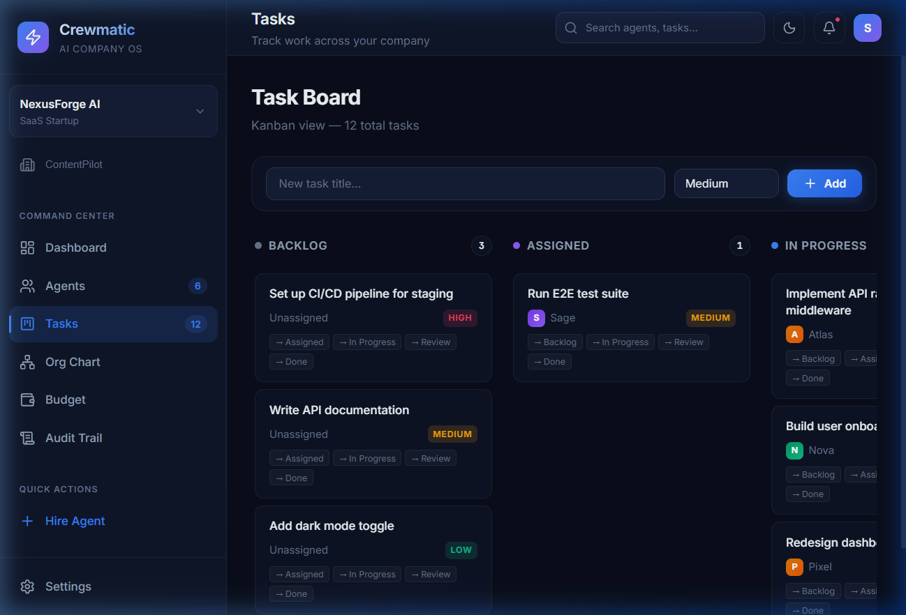
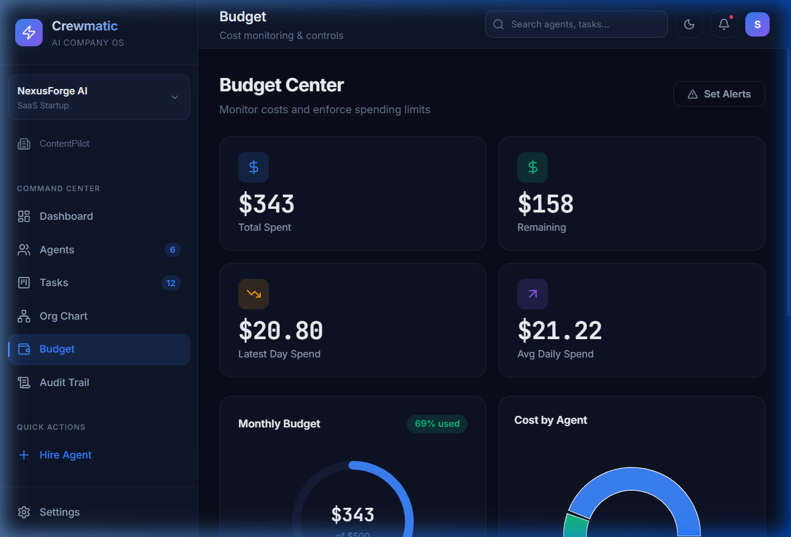

<div align="center">



# ⚡ Crewmatic

**Open-source orchestration for zero-human companies.**

Hire AI employees, set goals, automate jobs — and your business runs itself.

[](LICENSE)
[](https://nodejs.org/)
[](https://www.typescriptlang.org/)
[](https://react.dev/)
[](https://www.sqlite.org/)
[](CONTRIBUTING.md)

[**Quick Start**](#-quick-start) · [**Screenshots**](#-screenshots) · [**Architecture**](#-architecture) · [**API Reference**](#-api-reference) · [**Roadmap**](#-roadmap) · [**Contributing**](CONTRIBUTING.md)

</div>

---

## 💡 What is Crewmatic?

**Imagine you're running a company — but instead of hiring humans, you hire AI agents.**

Crewmatic is a dashboard that lets you manage all your AI workers from one place. You can:

- **Hire agents** like Claude, OpenClaw, or Codex — just like hiring employees
- **Give them tasks** using a drag-and-drop board
- **Watch them work** in real-time
- **Track spending** so you know exactly what each agent costs
- **Get alerts** when something goes wrong or a budget runs out

### 🧐 Why do I need this?

If you've ever had multiple AI tools running at the same time, you know the chaos:

| Without Crewmatic | With Crewmatic |
|---|---|
| 😵 20 terminal windows, no idea who's doing what | 📋 One dashboard showing all agents and tasks |
| 💸 Bills piling up with no breakdown | 💰 Per-agent cost tracking with budget limits |
| 🔇 Agent crashed 2 hours ago, nobody noticed | 💓 Heartbeat monitoring with instant alerts |
| 🤷 "What happened last night?" | 📜 Full audit trail of every action |

### In short:

> **If an AI agent is an employee, Crewmatic is the company they work at.**
>
> You're the CEO. Crewmatic is your office, your HR system, and your accounting department — all in one.

---

## 🚀 Quick Start

```bash
# Clone the repo
git clone https://github.com/SubhabrataTripathy/crewmatic.git
cd crewmatic

# Install dependencies
npm install

# Start the full stack (server + client)
npm run dev
```

This starts:
- 🌐 **Frontend** → http://localhost:5173
- 🔌 **API Server** → http://localhost:3001/api
- 📡 **WebSocket** → ws://localhost:3001/ws

> The database is auto-created and seeded with demo data on first run.

### Prerequisites

- [Node.js](https://nodejs.org/) ≥ 18
- npm ≥ 9

---

## 📸 Screenshots

### 🖥️ Dashboard — Your Command Center

See everything at a glance: active agents, tasks in progress, money spent, and live activity.



---

### 🤖 Agents — Your AI Workforce

Hire and manage AI agents. Each card shows what they're working on, how much they've cost, and whether they're still alive.



---

### 📋 Tasks — Kanban Board

Organize work across 5 columns: Backlog → Assigned → In Progress → Review → Done. Add tasks with one click.



---

### 💰 Budget — Know Where Your Money Goes

Track every dollar. Set spending limits. Get warnings before you overspend.



---

## 🏗️ Architecture

```
crewmatic/
├── server/                      # Express backend
│   ├── index.ts                # Server entry (Express + WS + lifecycle)
│   ├── db.ts                   # SQLite schema (7 tables)
│   ├── seed.ts                 # Demo data seeder
│   ├── websocket.ts            # WebSocket broadcast server
│   ├── routes/
│   │   ├── companies.ts        # Company CRUD
│   │   ├── agents.ts           # Agent hire / fire / heartbeat
│   │   ├── tasks.ts            # Task CRUD + status transitions
│   │   ├── budget.ts           # Budget & cost tracking
│   │   ├── audit.ts            # Audit log queries
│   │   └── goals.ts            # Goals / OKR CRUD
│   └── services/
│       ├── audit.ts            # Audit logging service
│       └── heartbeat.ts        # Agent health monitor (15s interval)
├── src/                         # React frontend
│   ├── lib/
│   │   ├── api.ts              # REST API client
│   │   └── ws.ts               # WebSocket client (auto-reconnect)
│   ├── stores/
│   │   └── appStore.ts         # Zustand store ↔ API
│   ├── pages/                  # 8 page components
│   │   ├── Dashboard.tsx       # Command center
│   │   ├── Agents.tsx          # Workforce management
│   │   ├── Tasks.tsx           # Kanban board
│   │   ├── Budget.tsx          # Cost monitoring
│   │   ├── Audit.tsx           # Activity log
│   │   ├── OrgChart.tsx        # Company hierarchy
│   │   ├── Settings.tsx        # Configuration
│   │   └── Onboarding.tsx      # Setup wizard
│   └── components/layout/      # Sidebar, Header
├── crewmatic.db                 # SQLite (auto-created, gitignored)
├── package.json
└── README.md
```

### Tech Stack

| Layer | Technology | Purpose |
|-------|-----------|---------|
| Frontend | React 19 + TypeScript | UI components |
| Bundler | Vite 8 | Hot module replacement |
| State | Zustand | Global state ↔ API |
| Charts | Recharts | Data visualization |
| Icons | Lucide React | UI icons |
| Backend | Express 5 | REST API + middleware |
| Database | SQLite (better-sqlite3) | Persistent storage |
| Real-time | WebSocket (ws) | Live event broadcasting |
| Runtime | tsx | TypeScript execution |

### Database Schema

```sql
companies     → id, name, description, type, status, config
agents        → id, company_id, name, type, role, status, current_task_id, total_cost, uptime_percent, last_heartbeat
tasks         → id, company_id, agent_id, title, status, priority, result, completed_at
budgets       → id, company_id, total_limit, spent, period, alert_threshold
cost_entries  → id, company_id, agent_id, amount, provider, tokens_used
audit_log     → id, company_id, agent_id, agent_name, action, details, type
goals         → id, company_id, title, description, status, progress
policies      → id, company_id, name, rule_type, config, enabled
```

---

## 📡 API Reference

### Companies
| Method | Endpoint | Description |
|--------|----------|-------------|
| `GET` | `/api/companies` | List all companies |
| `POST` | `/api/companies` | Create a company |
| `GET` | `/api/companies/:id` | Get company details |
| `PUT` | `/api/companies/:id` | Update company |
| `DELETE` | `/api/companies/:id` | Delete company |

### Agents
| Method | Endpoint | Description |
|--------|----------|-------------|
| `GET` | `/api/agents?company_id=` | List agents |
| `POST` | `/api/agents` | **Hire** an agent |
| `PUT` | `/api/agents/:id` | Update agent |
| `POST` | `/api/agents/:id/heartbeat` | Report heartbeat |
| `DELETE` | `/api/agents/:id` | **Fire** an agent |

### Tasks
| Method | Endpoint | Description |
|--------|----------|-------------|
| `GET` | `/api/tasks?company_id=` | List tasks |
| `POST` | `/api/tasks` | Create task |
| `PUT` | `/api/tasks/:id` | Update task / move status |
| `DELETE` | `/api/tasks/:id` | Delete task |

### Budget & Costs
| Method | Endpoint | Description |
|--------|----------|-------------|
| `GET` | `/api/budget/:company_id` | Get budget config |
| `PUT` | `/api/budget/:company_id` | Update budget limits |
| `GET` | `/api/budget/:company_id/summary` | Aggregated cost data |
| `POST` | `/api/budget/:company_id/costs` | Add cost entry |

### WebSocket Events

Connect to `ws://localhost:3001/ws` for real-time updates:

```
agent:hired, agent:fired, agent:updated, agent:heartbeat, agent:error
task:created, task:updated, task:deleted
budget:updated, budget:alert, cost:added
audit:new, goal:created, goal:updated
```

---

## 🗺️ Roadmap

- [x] **v0.1** — Full-stack MVP (Express + React + SQLite)
- [ ] **v0.2** — Real agent adapters (Claude Code, OpenClaw, Codex)
- [ ] **v0.3** — Desktop app via Tauri v2 (Windows, macOS, Linux)
- [ ] **v0.4** — System tray + background agent execution
- [ ] **v0.5** — Drag-and-drop task board
- [ ] **v0.6** — Company templates marketplace ("CrewMart")
- [ ] **v0.7** — Multi-user authentication + team access controls
- [ ] **v1.0** — Production-ready release with Rust backend

---

## 🤝 Contributing

We welcome contributions! See [CONTRIBUTING.md](CONTRIBUTING.md) for guidelines.

### Areas We Need Help

| Area | Description |
|------|-------------|
| 🔌 Agent Adapters | Connect Claude Code, OpenClaw, Codex as real agents |
| 🖥️ Desktop | Tauri v2 packaging for native desktop app |
| 🧪 Testing | Unit tests, E2E tests, API tests |
| 📖 Docs | Guides, tutorials, example setups |
| 🌐 i18n | Multi-language support |
| 🎨 Themes | Light mode, custom themes |

---

## 📜 Inspiration

Crewmatic stands on the shoulders of these projects:

- [Paperclip](https://github.com/paperclipai/paperclip) — AI company framework
- [gstack](https://github.com/garrytan/gstack) — AI-powered dev stack
- [Hermes Agent](https://github.com/NousResearch/hermes-agent) — Autonomous agent framework
- [Superpowers](https://github.com/obra/superpowers) — Agent capability framework

---

## 📄 License

MIT — see [LICENSE](LICENSE) for details.

---

<div align="center">

**Built with ⚡ by the Crewmatic community**

[Report Bug](https://github.com/SubhabrataTripathy/crewmatic/issues) · [Request Feature](https://github.com/SubhabrataTripathy/crewmatic/issues) · [Discussions](https://github.com/SubhabrataTripathy/crewmatic/discussions)

</div>
